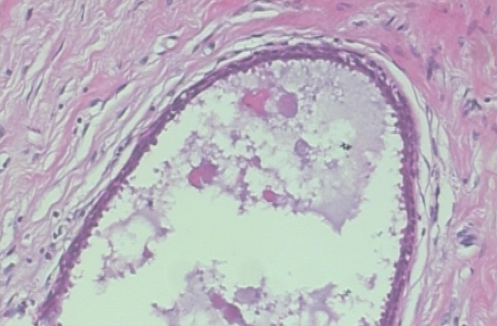
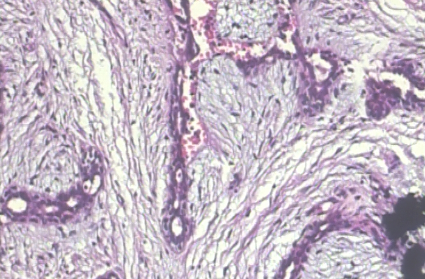
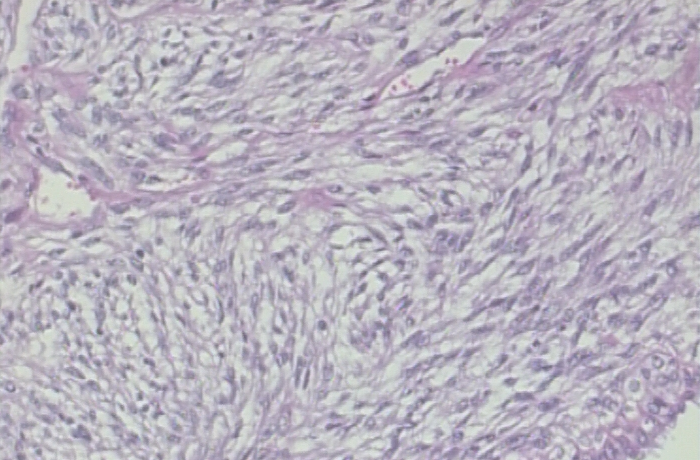
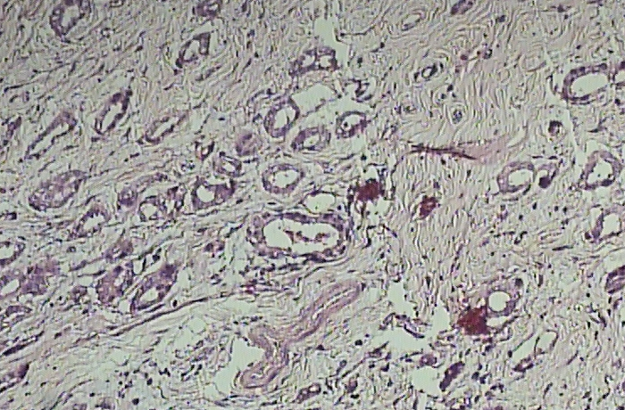
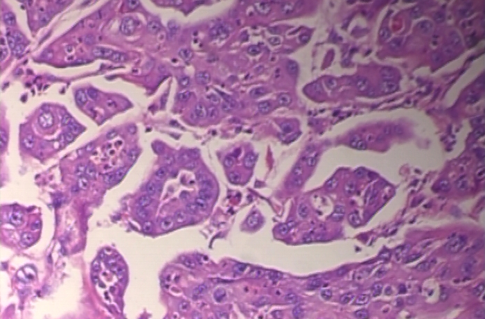
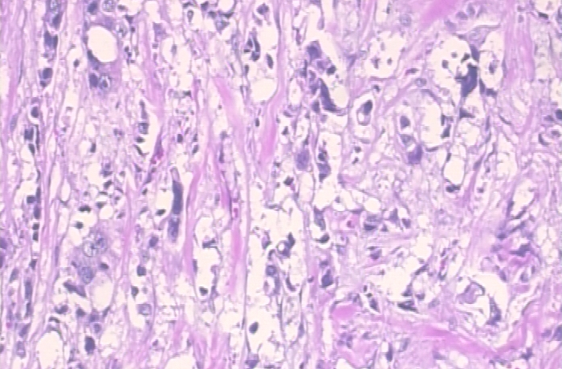
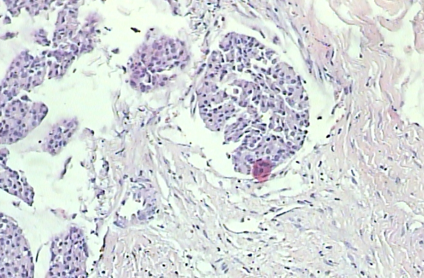
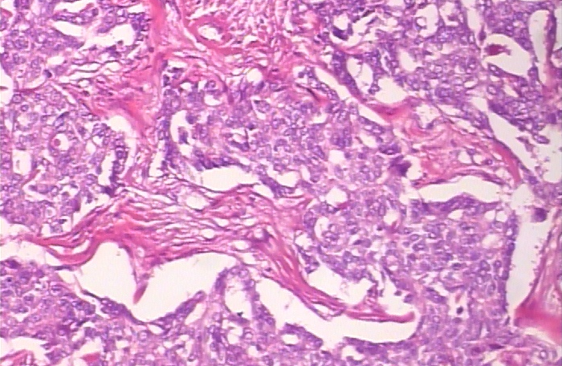

# Self-Supervised-Breast-Cancer-Diagnoser

### Benign

    

        
        
Arendos

    

    

        
        
Fibroadenoma

    

    

        
        
Phyllodes Tumor

    

    

        
        
Tubular Adenoma

    

### Malignant

    

        
        
Ductal Carcinoma

    

    

        
        
Lobular Carcinoma

    

    

        
        
Mucinous Carcinoma

    

    

        
        
Papillary Carcinoma

    

 
### Results on BreakHis Dataset

    

        
        
8-way Classification

    

    

        
        
Binary Classification

    

